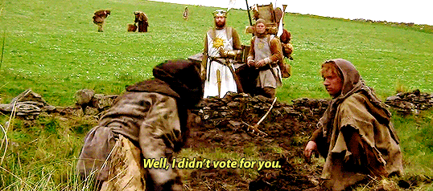

<script setup>
import StudiaCard from '../../src/components/StudiaCard.vue'
</script>

# Card

Card components are used to contain or call out information to visually separate it from the rest of the page.
Images can be inserted into the header, footer, or body of the card. The text in the header and footer of the card is formatted differently than the body text.

## Header, Footer, and Body Text

<StudiaCard>
<template #header>Well, how'd you become king, then?</template>
The Lady of the Lake, her arm clad in the purest shimmering samite, held aloft Excalibur from the bosom of the water, signifying by divine providence that I, Arthur, was to carry Excalibur. That is why I am your king.
<template #footer>Monty Python and the Holy Grail</template>
</StudiaCard>

```vue
<StudiaCard>
<template #header>Well, how'd you become king, then?</template>
The Lady of the Lake, her arm clad in the purest shimmering samite, held aloft Excalibur from the bosom of the water, signifying by divine providence that I, Arthur, was to carry Excalibur. That is why I am your king.
<template #footer>Monty Python and the Holy Grail</template>
</StudiaCard>
```

## Header image, Footer and Body text
<StudiaCard>
<template #header>

</template>
The Lady of the Lake, her arm clad in the purest shimmering samite, held aloft Excalibur from the bosom of the water, signifying by divine providence that <a href="/">I, Arthur, was to carry Excalibur</a>. That is why I am your king.
<template #footer><a href="/">Example link</a> - Example Plain Text</template>
</StudiaCard>

```vue
<StudiaCard>
<template #header>
  
</template>
The Lady of the Lake, her arm clad in the purest shimmering samite, held aloft Excalibur from the bosom of the water, signifying by divine providence that <a href="/">I, Arthur, was to carry Excalibur</a>. That is why I am your king.
<template #footer>
  <a href="/">Example link</a> - Example Plain Text
</template>
</StudiaCard>
```

## Body text only
<StudiaCard>
The Lady of the Lake, her arm clad in the purest shimmering samite, held aloft Excalibur from the bosom of the water, signifying by divine providence that I, Arthur, was to carry Excalibur. That is why I am your king.
</StudiaCard>

```vue
<StudiaCard>
The Lady of the Lake, her arm clad in the purest shimmering samite, held aloft Excalibur from the bosom of the water, signifying by divine providence that I, Arthur, was to carry Excalibur. That is why I am your king.
</StudiaCard>
```

## Usage
### Slots
| Slot      | Description                   |
|-----------|-------------------------------|
| `header`  | Optional heading for the card |
| `default` | Content of the card           |
| `footer`  | Optional footer for the card  |
