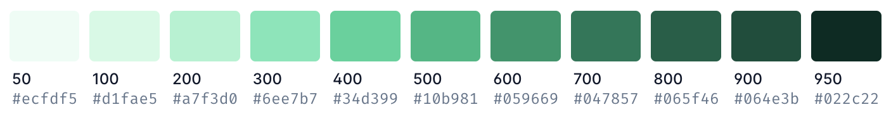

# Colours

Studia uses a curated list of the colours available in TailwindCSS.
They can be modified to darker or lighter by appending `-[100-900]` (i.e. `primary-100`).

Page backgrounds should be white (`#FFFFFF`) and text should be black (`#000000`).

The below colour spectrums are sourced from TailwindCSS's [Customizing Colors](https://tailwindcss.com/docs/customizing-colors) documentation.

### Primary

### Secondary

### Gray

### Warning

### Danger

### Success

### Info

